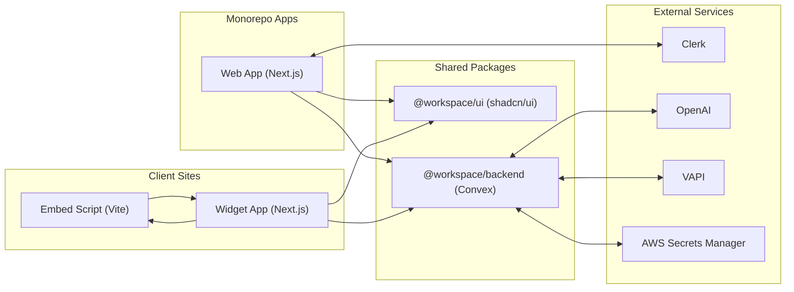

# Fusionchat Monorepo

Fusionchat is a modern, cloud-native customer engagement platform that enables businesses to deliver seamless, AI-powered chat experiences across multiple channels. Built on a serverless architecture with Next.js, Convex backend, Clerk authentication and a shared UI library based on shadcn/ui. Fusionchat combines enterprise-grade security with developer-friendly extensibility.

## Contents

- apps/
  - web/ — Admin/dashboard app (Next.js 15, App Router, Clerk, Convex)
  - widget/ — Hosted chat widget app (Next.js 15, embedded in an iframe)
  - embed/ — Lightweight embed script (Vite) to place the widget on any site
- packages/
  - backend/ — Convex functions, schema, and integrations (AI, VAPI, AWS)
  - ui/ — Shared UI component library (shadcn/ui-based)
  - math/ — Example TS lib (build + exports setup)
  - eslint-config/ — Centralized ESLint configs
  - typescript-config/ — Centralized TypeScript configs
- Security — see [Security Quickstart](#security-quickstart) and [SECURITY.md](./SECURITY.md)

## Architecture Overview

- Next.js App Router across web and widget apps with server components by default.
- Auth via Clerk:
  - Edge `middleware.ts` gatekeeping routes in `apps/web/`.
  - `ClerkProvider` initialized in `apps/web/app/layout.tsx`.
- Data & Realtime via Convex:
  - Client: `ConvexProviderWithClerk` wired in `apps/web/components/providers.tsx` (requires `NEXT_PUBLIC_CONVEX_URL`).
  - Backend: Convex functions in `packages/backend/convex/`, schema in `packages/backend/convex/schema.ts`.
- Embedding strategy:
  - `apps/embed/embed.ts` injects a floating button and loads `apps/widget` in an iframe using a `WIDGET_URL` and `organizationId` query param.
- Shared UI:
  - `@workspace/ui` exports `globals.css`, components, hooks, and lib for consumption in apps via `transpilePackages`.
- Monorepo tooling:
  - pnpm workspaces, Turbo for tasks and caching, shared TS and ESLint configs.

## Security Quickstart

> Start here to keep deployments safe. See [`SECURITY.md`](./SECURITY.md) for the full policy.
>
> - Store secrets in environment managers (Vercel/Convex/AWS), not in git. Use `*.env.example` templates.
> - Configure Clerk correctly and protect routes via `apps/web/middleware.ts`.
> - Set `NEXT_PUBLIC_CONVEX_URL` to the correct environment for each app.
> - Validate postMessage origins in production for the embed/widget pairing.
> - Rotate any leaked keys immediately and purge history if necessary.

## Architecture Diagram



## Backend API Reference and Usage Map

- See `packages/backend/README.md#api-reference` for a detailed list of Convex public/private/system functions and argument schemas.
- See `packages/backend/README.md#web-app-→-backend-usage-map` for how `apps/web` modules call these endpoints using `@workspace/backend/_generated/api` with `useQuery`, `useMutation`, and `useAction`.

## Deployment

### 1) Convex (Production)

- Create/Select a Convex project for production.
- Set production environment variables in Convex (e.g., Clerk issuer domain, secrets managed via AWS if applicable).
- Push functions:

```bash
# From repo root or backend package
pnpm --filter @workspace/backend dev # for local
# For production deployment, use Convex dashboard/CLI per docs
```

- Update app envs with the production `CONVEX_URL` and ensure `NEXT_PUBLIC_CONVEX_URL` points to it.

### 2) Vercel (Web and Widget Apps)

- Import `apps/web` and `apps/widget` into Vercel as separate projects or a monorepo with two deployments.
- Build command: `pnpm build`
- Install command: `pnpm install`
- Output: `.next`
- Node version: 20+
- Env vars to configure in Vercel:
  - Both apps: `NEXT_PUBLIC_CONVEX_URL` (production Convex URL)
  - Web app only: Clerk keys/URLs (`NEXT_PUBLIC_CLERK_PUBLISHABLE_KEY`, `CLERK_SECRET_KEY`, and sign-in/up URLs)
- Set `transpilePackages` already configured in `next.config.mjs` for `@workspace/ui`.

### 3) Embed Script (CDN)

- Build `apps/embed`:

```bash
pnpm --filter embed build
```

- Publish `apps/embed/dist/` to your CDN (e.g., Cloudflare R2 + public endpoint, Vercel Static Hosting, S3 + CloudFront).
- At build time, set `VITE_WIDGET_URL` to your production Widget domain so `EMBED_CONFIG.WIDGET_URL` is correct.
- Usage on client sites:

```html
<script
  src="https://your-cdn.com/embed.js"
  data-organization-id="org_123"
  data-position="bottom-right"
  defer
></script>
```

- Optional programmatic control via `window.FusionchatWidget`:

```js
window.FusionchatWidget.show();
window.FusionchatWidget.hide();
window.FusionchatWidget.destroy();
window.FusionchatWidget.init({ organizationId: "org_456", position: "bottom-left" });
```

### 4) Secrets Management

- Do not commit secrets; use Vercel/Convex/AWS secret managers.
- For VAPI and other integrations, store secret values in AWS Secrets Manager and reference the secret name in Convex plugins (see `packages/backend/convex/private/plugins.ts`).

### 5) Post-Deployment Checks

- Verify `NEXT_PUBLIC_CONVEX_URL` and Clerk URLs resolve in production.
- Confirm iframe origin messaging between Embed and Widget works (correct production origins).
- Validate Convex public endpoints respond and session validation flows correctly for widget traffic.

## Prerequisites

- Node.js >= 20
- pnpm >= 10
- Convex CLI: `npm i -g convex`
- Optional: Vercel CLI if deploying to Vercel

## Getting Started

1) Install dependencies at the repo root:

```bash
pnpm install
```

2) Configure environment variables:

- Each app/package has its own `.env.local` (do not commit secrets).
- Required variables (non-exhaustive):

```bash
# apps/web/.env.local
NEXT_PUBLIC_CONVEX_URL=...
NEXT_PUBLIC_CLERK_PUBLISHABLE_KEY=...
CLERK_SECRET_KEY=...
NEXT_PUBLIC_CLERK_SIGN_IN_URL=/sign-in
NEXT_PUBLIC_CLERK_SIGN_UP_URL=/sign-up
NEXT_PUBLIC_CLERK_SIGN_IN_FALLBACK_REDIRECT_URL=/
NEXT_PUBLIC_CLERK_SIGN_UP_FALLBACK_REDIRECT_URL=/

# packages/backend/.env.local
CONVEX_DEPLOYMENT=dev:your-deployment
CONVEX_URL=https://<your-project>.convex.cloud
CLERK_JWT_ISSUER_DOMAIN=https://<your-clerk-domain>.clerk.accounts.dev
CLERK_SECRET_KEY=...
OPENAI_API_KEY=...
AWS_ACCESS_KEY_ID=...
AWS_SECRET_ACCESS_KEY=...
AWS_REGION=us-east-1
```

Security note: Never commit real secrets. Use environment managers (Vercel/Convex secrets) in production.

3) Run the stack locally (from repo root):

```bash
# Start backend Convex dev in a separate terminal
pnpm --filter @workspace/backend dev

# Start web app
pnpm --filter web dev

# Start widget app
pnpm --filter widget dev

# Start embed script dev server
pnpm --filter embed dev
```

Ports used by default:
- web: 3000
- widget: 3001
- embed (Vite): 3002

Alternatively, use Turbo to orchestrate:

```bash
pnpm dev
```

## Apps

### apps/web

- Next.js 15 App Router with Clerk middleware (`apps/web/middleware.ts`).
- Root layout: `apps/web/app/layout.tsx` sets fonts, `ClerkProvider`, and Convex provider.
- Redirects `/` to `/conversations` via `apps/web/next.config.mjs`.
- Modules organized under `apps/web/modules/` (auth, customization, dashboard, files, integrations, plugins).
- Hooks: example `useIsMobile` in `apps/web/hooks/use-mobile.ts`.

Run:
```bash
pnpm --filter web dev
```

### apps/widget

- Hosted widget app rendered inside an iframe by the embed script.
- Minimal routing in `apps/widget/app/`, providers in `apps/widget/components/providers.tsx`.

Run:
```bash
pnpm --filter widget dev
```

### apps/embed

- Vite-built vanilla TS snippet that injects a floating chat button and an iframe.
- Core file: `apps/embed/embed.ts`.
- Reads attributes from the `<script>` tag such as `data-organization-id` and optional `data-position`.

Run:
```bash
pnpm --filter embed dev
```

Embed usage example:

```html
<script
  src="https://your-cdn.com/embed.js"
  data-organization-id="org_123"
  data-position="bottom-right"
  defer
></script>
```

Optionally, control it programmatically:

```js
window.FusionchatWidget.show();
window.FusionchatWidget.hide();
window.FusionchatWidget.destroy();
window.FusionchatWidget.init({ organizationId: "org_456", position: "bottom-left" });
```

## Backend (packages/backend)

- Convex schema: `packages/backend/convex/schema.ts` defines tables for subscriptions, widget settings, plugins, conversations, contact sessions, and users with indices.
- Convex functions: organized under `public/`, `private/`, and `system/`.
- Auth config: `packages/backend/convex/auth.config.ts` and `users.ts` helpers.
- Integrations: `@convex-dev/agent`, `@convex-dev/rag`, `@vapi-ai/server-sdk`, `@ai-sdk/openai` and AWS SDK for secrets/storage.

Run:
```bash
pnpm --filter @workspace/backend dev
```

## Shared UI (packages/ui)

- shadcn/ui-based library exporting components, hooks, lib utilities, and Tailwind globals.
- Consumed via `@workspace/ui/*` with `transpilePackages` configured in app `next.config.mjs`.

Usage example:
```tsx
import { Button } from "@workspace/ui/components/button";
```

## Development Conventions

- App Router in `app/` directory; default Server Components. Add `"use client"` where interactivity is needed.
- Layouts via `layout.tsx` and nested layouts for shared UI.
- Styling: Tailwind CSS + shadcn UI. Import `@workspace/ui/globals.css` in root layout.
- Data fetching: Server Components async/await on the server; client-side state via Jotai/React Hook Form; Convex React hooks on the client.
- Forms & Validation: React Hook Form + Zod; validate both client and server-side where applicable.
- TypeScript: strict mode; type every function param and return; avoid `any`.
- Files & naming: kebab-case dirs/files; components/types PascalCase; hooks prefixed `use*`.
- Organization:
  - Services (API calls) → `src/services/` (or module-local `services/`)
  - Helpers → `src/utils/`
  - Hooks → `src/hooks/`

## Scripts & Tooling

- Root scripts (Turbo):
  - `pnpm build` — Build all packages/apps
  - `pnpm dev` — Run all apps in dev mode (non-cached)
  - `pnpm lint` — Lint all
  - `pnpm format` — Prettier format
- Per-app scripts in `package.json` of each app.

## Security & Secrets

- Do not commit secrets. Use `.env.local` locally and secret managers in production.
- Clerk keys, OpenAI, and AWS credentials are sensitive. Rotate if exposed.
- Limit logs to avoid leaking PII. Follow least-privilege on AWS IAM.

## Troubleshooting

- Missing `NEXT_PUBLIC_CONVEX_URL`: the web app will throw early in `apps/web/components/providers.tsx`. Ensure Convex dev is running and URL is set.
- Auth redirect loop: verify `apps/web/middleware.ts` public routes and your Clerk configuration/URLs.
- Module import errors from `@workspace/ui`: ensure `transpilePackages` includes `"@workspace/ui"` and that the package builds.
- Convex schema mismatch: re-run Convex dev and push functions if needed.

## Roadmap

- Add detailed app-level READMEs for `web`, `widget`, and `embed` with screenshots.
- Expand backend docs with function references and sequence diagrams.
- Add CONTRIBUTING.md and PR templates.

## License

Proprietary FusionwaveAI. All rights reserved.

