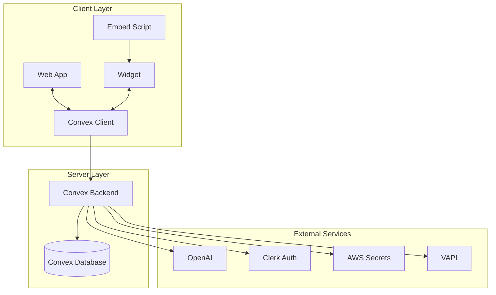

# Fusionchat: Modern Customer Engagement Platform

## Table of Contents
1. [Executive Summary](#1-executive-summary)
2. [Introduction](#2-introduction)
3. [Technical Architecture](#3-technical-architecture)
4. [Data Model](#4-data-model)
5. [Security & Compliance](#5-security--compliance)
6. [Integration Capabilities](#6-integration-capabilities)
7. [Deployment Options](#7-deployment-options)
8. [Use Cases](#8-use-cases)
9. [API Reference](#9-api-reference)
10. [Conclusion & Roadmap](#10-conclusion--roadmap)

## 1. Executive Summary

Fusionchat is a modern, cloud-native customer engagement platform that enables businesses to deliver seamless, AI-powered chat experiences across multiple channels. Built on a serverless architecture with Next.js, Convex, and Clerk, Fusionchat combines enterprise-grade security with developer-friendly extensibility.

### Key Features
- **Embeddable Chat Widget**: Lightweight, customizable chat interface
- **AI-Powered Conversations**: OpenAI integration for intelligent responses
- **Multi-tenant Architecture**: Isolated data and configurations per organization
- **Real-time Communication**: WebSocket-based updates for instant messaging
- **Extensible Platform**: Plugin system for custom integrations

## 2. Introduction

### Problem Statement
Modern businesses struggle with:
- Disjointed customer communication channels
- Complex integration requirements
- Security and compliance challenges
- Limited customization options

### Solution Overview
Fusionchat addresses these challenges through:
- Unified communication platform
- Developer-first architecture
- Enterprise-grade security
- Flexible deployment options

## 3. Technical Architecture

### High-Level Overview



### Core Components

#### 1. Web Application (`apps/web/`)
- Next.js 15 with App Router
- Server Components by default
- Clerk authentication
- Real-time data with Convex

#### 2. Widget Application (`apps/widget/`)
- Lightweight Next.js app
- Embedded via iframe
- Customizable UI components
- Real-time updates

#### 3. Embed Script (`apps/embed/`)
- <5KB gzipped
- Loads widget asynchronously
- Configurable initialization
- Global API for control

#### 4. Backend (`packages/backend/`)
- Convex serverless functions
- Real-time database
- Authentication integration
- Plugin system

## 4. Data Model

### Core Entities

#### 1. Organizations
```typescript
interface Organization {
  _id: Id<"organizations">
  name: string
  createdAt: number
  updatedAt: number
}
```

#### 2. Users
```typescript
interface User {
  _id: Id<"users">
  organizationId: Id<"organizations">
  clerkUserId: string
  role: 'admin' | 'agent' | 'user'
  createdAt: number
}
```

#### 3. Conversations
```typescript
interface Conversation {
  _id: Id<"conversations">
  organizationId: Id<"organizations">
  status: 'open' | 'resolved' | 'escalated'
  participants: Id<"users">[]
  createdAt: number
  updatedAt: number
}
```

## 5. Security & Compliance

### Data Protection
- End-to-end encryption
- Role-based access control
- Audit logging
- Data retention policies

### Compliance
- GDPR/CCPA ready
- SOC 2 Type II (planned)
- HIPAA compliance (planned)

## 6. Integration Capabilities

### Built-in Integrations
- **Authentication**: Clerk
- **AI**: OpenAI
- **Telephony**: VAPI
- **Secrets**: AWS Secrets Manager

### Custom Integrations
- Webhook support
- REST API
- Plugin system

## 7. Deployment Options

### Cloud (SaaS)
- Fully managed service
- Automatic scaling
- 99.9% uptime SLA

### Self-Hosted
- Docker containers
- Kubernetes support
- On-premises deployment

## 8. Use Cases

### 1. Customer Support
- 24/7 AI assistance
- Seamless agent handoff
- Knowledge base integration

### 2. E-commerce
- Product recommendations
- Order tracking
- Abandoned cart recovery

### 3. Healthcare
- Appointment scheduling
- Prescription refills
- Telehealth integration

## 9. API Reference

### Authentication
```http
POST /api/auth/session
Content-Type: application/json

{
  "email": "user@example.com",
  "password": "securepassword"
}
```

### Send Message
```http
POST /api/conversations/{id}/messages
Authorization: Bearer {token}
Content-Type: application/json

{
  "content": "Hello, I need help with my order",
  "senderType": "user"
}
```

## 10. Conclusion & Roadmap

### Current Status
- Core chat functionality
- Basic AI integration
- Admin dashboard

### Upcoming Features
- Mobile SDKs
- Advanced analytics
- Custom workflow automation
- Additional channel support (SMS, WhatsApp)

### Get Started
Visit our [GitHub repository](https://github.com/yourorg/fusionchat) to get started with Fusionchat today.

---
*Last Updated: September 2023*
*Version: 1.0.0*
