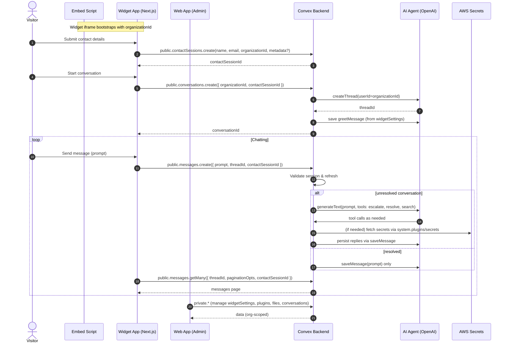
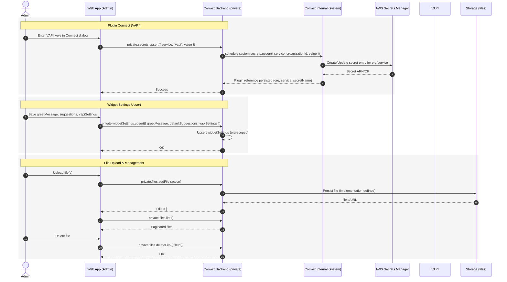
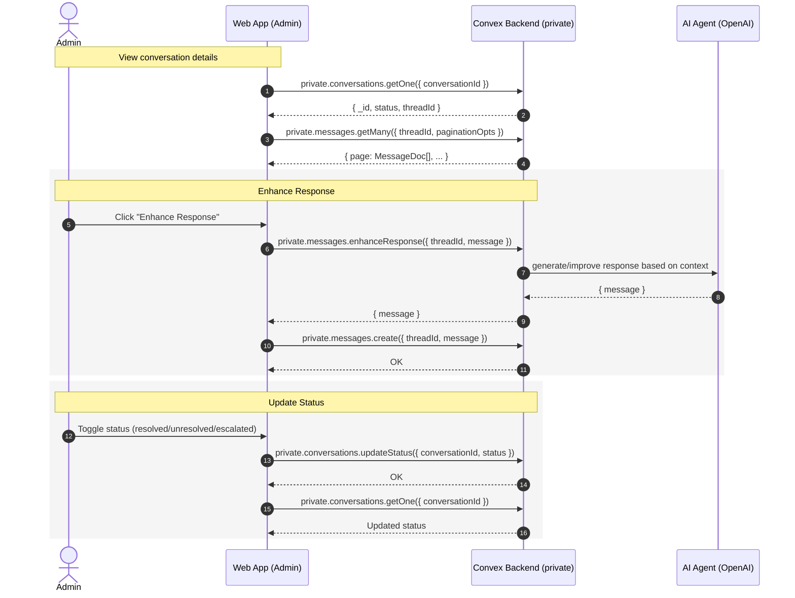

# Fusionchat Technical Yellow Paper

Version: 1.0

Author: Fusionchat Engineering

Date: 2025-09-13

---

## 1. Abstract

Fusionchat is a multi-tenant customer support chat platform featuring an embeddable widget, an administrator dashboard, and a serverless backend powered by Convex. This document provides a deep technical explanation of the system’s architecture, data model, protocols, APIs, security and threat model, performance, deployment topology, observability, and roadmap. It serves as a stable technical reference (“yellow paper”) for engineers and integrators.

---

## 2. System Overview

- Components
  - `apps/web/`: Admin Dashboard (Next.js 15 App Router) with Clerk auth and Convex client.
  - `apps/widget/`: Hosted widget (Next.js) embedded via iframe, driven by a lightweight embed script.
  - `apps/embed/`: Vite-built script that injects a floating button and loads the widget into an iframe.
  - `packages/backend/`: Convex backend with schema and functions, plus AI agents, secrets integration.
  - `packages/ui/`: Shared UI library (shadcn/ui, Tailwind v4) consumed by both Next.js apps.
- External Services
  - Clerk (auth), Convex (DB + functions), OpenAI (agents), VAPI (telephony), AWS Secrets Manager (secret storage).

---

## 3. Architecture

- Web application (`apps/web/`)
  - Root layout: `apps/web/app/layout.tsx` wires `ClerkProvider` and `Providers` that initialize Convex client (`apps/web/components/providers.tsx`).
  - Middleware: `apps/web/middleware.ts` protects routes and enforces organization selection.
  - Modules: `apps/web/modules/` (auth, customization, dashboard, files, integrations, plugins).
- Widget application (`apps/widget/`)
  - Root layout: `apps/widget/app/layout.tsx` with `Providers` and full-viewport container.
  - Receives `organizationId` via query string from the embed script.
- Embed script (`apps/embed/`)
  - Core: `apps/embed/embed.ts` creates a floating action button and an iframe to load the widget from `EMBED_CONFIG.WIDGET_URL` (`apps/embed/config.ts`).
  - Exposes global API: `window.FusionchatWidget.{init,show,hide,destroy}`.
- Backend (`packages/backend/convex/`)
  - Schema: `packages/backend/convex/schema.ts` defines tables and indexes.
  - Public/Private/System functions under `convex/public/`, `convex/private/`, `convex/system/`.
  - Agents: `convex/system/ai/*` integrate with OpenAI and tools (escalate, resolve, search).

---

## 4. Data Model (Convex Schema)

Defined in `packages/backend/convex/schema.ts`:

- `subscriptions`
  - Fields: `organizationId: string`, `status: string`
  - Indexes: `by_organization_id`
- `widgetSettings`
  - Fields: `organizationId: string`, `greetMessage: string`, `defaultSuggestions: { suggestion1?, suggestion2?, suggestion3? }`, `vapiSettings: { assistantId?, phoneNumber? }`
  - Indexes: `by_organization_id`
- `plugins`
  - Fields: `organizationId: string`, `service: "vapi"`, `secretName: string`
  - Indexes: `by_organization_id`, `by_organization_id_and_service`
- `conversations`
  - Fields: `threadId: string`, `organizationId: string`, `contactSessionId: Id<"contactSessions">`, `status: "unresolved"|"escalated"|"resolved"`
  - Indexes: `by_organization_id`, `by_contact_session_id`, `by_thread_id`, `by_status_and_organization_id`
- `contactSessions`
  - Fields: `name: string`, `email: string`, `organizationId: string`, `expiresAt: number`, `metadata?`
  - Indexes: `by_organization_id`, `by_expires_at`
- `users`
  - Fields: `name: string`

---

## 5. Protocols and Flows

### 5.1 Widget Embedding and Messaging

- Boot:
  - `apps/embed/embed.ts` reads `<script data-organization-id>` and mounts a floating button.
  - On click, it toggles an iframe pointed at `EMBED_CONFIG.WIDGET_URL?organizationId=...`.
- Cross-Window Messaging (postMessage):
  - Widget → Embed: `{ type: 'close' }`, `{ type: 'resize', payload: { height } }`.
  - Embed listens and updates container.

### 5.2 Visitor Conversation Flow

- Create contact session: `public.contactSessions.create` → returns `contactSessionId`.
- Create conversation: `public.conversations.create` → creates agent thread, saves greet message, returns `conversationId`.
- Post user message: `public.messages.create` (action): validates session, triggers agent or saves message.
- Read messages: `public.messages.getMany` paginates via `supportAgent.listMessages`.

### 5.3 Admin Flows

- Plugin connect (VAPI): `private.secrets.upsert` schedules `system.secrets.upsert` → AWS Secrets Manager → plugin record stored for org.
- Widget settings upsert: `private.widgetSettings.upsert` updates org’s greet/suggestions/vapiSettings.
- File upload/list/delete: `private.files.addFile` (action) → storage; `private.files.list` (paginated); `private.files.deleteFile`.
- Conversation operations: `private.conversations.getOne/getMany/updateStatus`, `private.messages.enhanceResponse`, `private.messages.getMany`, `private.messages.create`.

---

## 6. API Specification (Convex)

Canonical reference in `packages/backend/README.md`:
- API Reference: Public / Private / System.
- API Tables (Return Types) with argument schemas and output shapes.
- Web App → Backend Usage Map showing `apps/web` call sites (e.g., `modules/customization/ui/views/customization-view.tsx`).

Representative endpoints:
- Public
  - `conversations.getMany/getOne/create`
  - `messages.create/getMany`
  - `contactSessions.create/validate`
  - `organizations.validate`
  - `secrets.getVapiSecrets`
- Private
  - `widgetSettings.getOne/upsert`, `plugins.getOne/remove`, `files.*`, `messages.*`, `conversations.*`, `secrets.upsert`, `vapi.*`
- System (internal)
  - `contactSessions.*`, `conversations.getByThreadId`, `plugins.getByOrganizationIdAndService`, `secrets.*`, `ai/*`

---

## 7. Security Model and Threat Analysis

- Authentication & Authorization
  - Admin: Clerk-authenticated users with `orgId` (see `apps/web/middleware.ts`, `private/*` functions reading `ctx.auth.getUserIdentity()`).
  - Visitor: Short-lived `contactSessions` with expiration; all public endpoints validate session (e.g., `public/conversations.ts`, `public/messages.ts`).
- Secrets Management
  - Secrets are not stored client-side; `private.secrets.upsert` schedules `system.secrets.upsert` to persist in AWS Secrets Manager (`packages/backend/convex/system/secrets.ts`).
  - `public/secrets.getVapiSecrets` returns only `publicApiKey` for client usage; server-only `privateApiKey` never returned to clients.
- Data Isolation
  - All organization-scoped tables indexed by `organizationId`.
  - Private endpoints derive `orgId` from Clerk identity to avoid tampering.
- CSRF & XSS
  - Widgets operate in iframe with strict postMessage origin checking in `apps/embed/embed.ts` (validates `event.origin`).
- Rate Limiting & Abuse
  - Recommend Convex-side rate limits for actions (extend with counters if necessary).
- Secrets in Git
  - Do not commit `.env.local`. If leaked, rotate keys immediately and purge history.

---

## 8. Performance & Scalability

- Client
  - Next.js App Router with server components minimizes client bundle; lazy-load heavy modules.
  - UI from `@workspace/ui` to avoid duplication.
- Backend
  - Convex indices for hot queries: conversations by status/org, by thread, sessions by expiry.
  - Agent calls are action-driven and asynchronous where needed.
- Caching & Pagination
  - `supportAgent.listMessages` returns paginated `page/isDone/continueCursor`.
  - Use Convex pagination hooks (`usePaginatedQuery`) appropriately in UI.
- Build & Dev Speed
  - Turbo with `transpilePackages` and pnpm workspaces.

---

## 9. Deployment Topology

- Production
  - Web & Widget → Vercel (Node 20+, `pnpm build`, `@workspace/ui` in `transpilePackages`).
  - Backend → Convex production deployment with environment variables set in Convex dashboard.
  - Embed → CDN (build from `apps/embed`, publish `/dist`, configure `VITE_WIDGET_URL`).
- Environments
  - Separate Convex deployments (dev/prod). Propagate `NEXT_PUBLIC_CONVEX_URL` to apps via Vercel env.

---

## 10. Observability & Operations

- Logging
  - Prefer structured logs in Convex functions; avoid secrets/PII in logs.
- Metrics
  - Track request volume per endpoint, agent call counts, and error rates (Convex + external APM recommended).
- Alerts
  - Setup alerts for Convex errors, OpenAI/VAPI failures, and elevated 4xx/5xx.
- Tracing
  - Optionally integrate with OpenTelemetry-compatible services for end-to-end traces.

---

## 11. Testing Strategy

- Unit
  - Validate schema-dependent utilities and hooks.
- Integration
  - Test Convex function contracts (public/private) with mock identities and sessions.
- E2E
  - Embed → Widget → Backend flow with a staging environment.
- Security Testing
  - Verify no leakage of `privateApiKey` and correct origin checks for postMessage.

---

## 12. Roadmap

- Advanced RAG pipelines for domain-specific knowledge.
- Conversation assignment and multi-agent escalation.
- Role-based access control for admin users.
- Analytics dashboard and export.
- Offline ingestion & backfill of historical messages.
- Observability enhancements with centralized logging and tracing.

---

## 13. Configuration & Environment

- Apps
  - `apps/web/.env.example`: `NEXT_PUBLIC_CONVEX_URL`, Clerk keys and URLs.
  - `apps/widget/.env.example`: `NEXT_PUBLIC_CONVEX_URL` (if needed).
- Backend
  - `packages/backend/.env.example`: `CONVEX_URL`, `CLERK_*`, `OPENAI_API_KEY`, `AWS_*`.
- Build
  - Root `turbo.json` and `package.json` orchestrate tasks; `packages/typescript-config/` and `packages/eslint-config/` provide shared configs.

---

## 14. Compliance & Privacy

- Data retention policies per organization (to be implemented).
- GDPR/CCPA readiness: enable user data export and deletion upon request.
- Minimize PII collection in `contactSessions.metadata` and mask where possible.

---

## 15. Appendix: Key Files

- `apps/web/middleware.ts`
- `apps/web/components/providers.tsx`
- `apps/embed/config.ts`, `apps/embed/embed.ts`
- `apps/widget/app/layout.tsx`
- `packages/backend/convex/schema.ts`
- `packages/backend/convex/public/*`
- `packages/backend/convex/private/*`
- `packages/backend/convex/system/*`
- `packages/ui/src/components/*`

---

## 16. Architecture Diagram

```mermaid
flowchart LR
  subgraph Client Sites
    E[Embed Script (Vite)] -- loads --> I[Widget App (Next.js)]
  end

  subgraph Monorepo Apps
    W[Web App (Next.js)]
    I
  end

  subgraph Shared Packages
    UI[@workspace/ui (shadcn/ui)]
    B[@workspace/backend (Convex)]
  end

  E -->|data-organization-id| I
  I -->|postMessage| E

  W -- uses components --> UI
  I -- uses components --> UI

  W -- Convex client --> B
  I -- Convex client/public endpoints --> B

  subgraph External Services
    Clerk[Clerk]
    OpenAI[OpenAI]
    Vapi[VAPI]
    AWS[AWS Secrets Manager]
  end

  W <-- auth --> Clerk
  B <-- secret lookup --> AWS
  B <-- agents/tools --> OpenAI
  B <-- telephony cfg --> Vapi
```

## 17. Sequence Diagrams

### 17.1 Visitor Conversation Flow



### 17.2 Admin Flows



### 17.3 Admin Conversations



---

